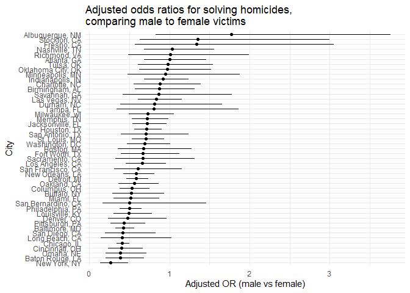
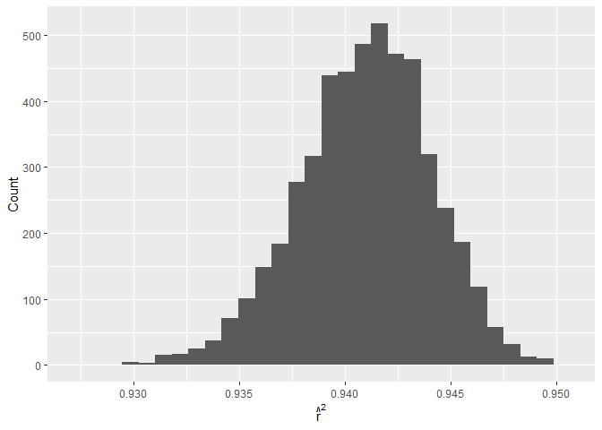
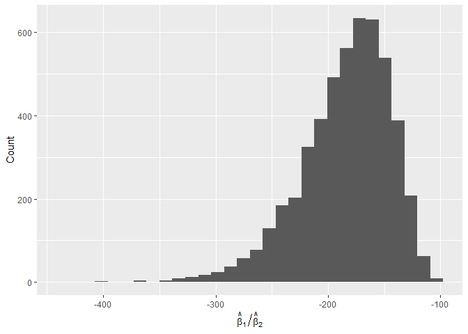
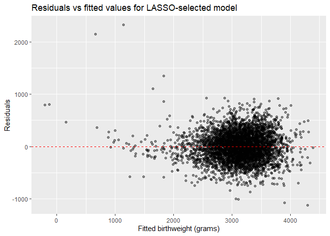

p8105_hw6_yd2868
================
2025-11-30

``` r
library(tidyverse)
```

    ## ── Attaching core tidyverse packages ──────────────────────── tidyverse 2.0.0 ──
    ## ✔ dplyr     1.1.4     ✔ readr     2.1.5
    ## ✔ forcats   1.0.0     ✔ stringr   1.5.1
    ## ✔ ggplot2   3.5.2     ✔ tibble    3.3.0
    ## ✔ lubridate 1.9.4     ✔ tidyr     1.3.1
    ## ✔ purrr     1.1.0     
    ## ── Conflicts ────────────────────────────────────────── tidyverse_conflicts() ──
    ## ✖ dplyr::filter() masks stats::filter()
    ## ✖ dplyr::lag()    masks stats::lag()
    ## ℹ Use the conflicted package (<http://conflicted.r-lib.org/>) to force all conflicts to become errors

``` r
library(broom)
library(p8105.datasets)
library(modelr)
```

    ## 
    ## 载入程序包：'modelr'
    ## 
    ## The following object is masked from 'package:broom':
    ## 
    ##     bootstrap

``` r
library(glmnet)
```

    ## 载入需要的程序包：Matrix
    ## 
    ## 载入程序包：'Matrix'
    ## 
    ## The following objects are masked from 'package:tidyr':
    ## 
    ##     expand, pack, unpack
    ## 
    ## Loaded glmnet 4.1-10

``` r
library(purrr)
```

# Problem1

import and clean the data

``` r
homicides = read.csv("data-homicides-master/homicide-data.csv")|>
  mutate(
    city_state = str_c(city, ", ", state),
    victim_age = as.numeric(victim_age),
    solved = if_else(disposition == "Closed by arrest", 1, 0)
  ) |>
  filter(
    !city_state %in% c("Dallas, TX",
                       "Phoenix, AZ",
                       "Kansas City, MO",
                       "Tulsa, AL"),
    victim_race %in% c("White", "Black"),
    !is.na(victim_age)
  )
```

    ## Warning: There was 1 warning in `mutate()`.
    ## ℹ In argument: `victim_age = as.numeric(victim_age)`.
    ## Caused by warning:
    ## ! 强制改变过程中产生了NA

glm for Baltimore,MD

``` r
baltimore = 
  homicides |>
  filter(city_state == "Baltimore, MD")

glm_Baltimore = glm(
  solved ~ victim_age + victim_race + victim_sex,
  data   = baltimore,
  family = binomial()
)

baltimore_OR = tidy(glm_Baltimore, conf.int = TRUE, exponentiate = TRUE)
```

The estimate of the adjusted odds ratio for solving homicides comparing
male victims to female victims keeping all other variables fixed is
0.32, confidence interval is 0.324 - 0.558

glm for all cities

``` r
city_nest = homicides |>
  nest(data = -city_state)

city_OR_results =
  city_nest|>
  mutate(
    fit = map(data, \(x) glm(
      solved ~ victim_age + victim_race + victim_sex,
      data = x,
      family = binomial()
    )),
    tidied = map(fit, \(x) tidy(x, exponentiate = TRUE, conf.int = TRUE))
  ) |>
  unnest(tidied)
```

    ## Warning: There were 45 warnings in `mutate()`.
    ## The first warning was:
    ## ℹ In argument: `tidied = map(fit, function(x) tidy(x, exponentiate = TRUE,
    ##   conf.int = TRUE))`.
    ## Caused by warning:
    ## ! glm.fit:拟合概率算出来是数值零或一
    ## ℹ Run `dplyr::last_dplyr_warnings()` to see the 44 remaining warnings.

create the plot

``` r
city_sex_OR =
  city_OR_results |>
  filter(term == "victim_sexMale") |>
  mutate(
    city_state = reorder(city_state, estimate)
  )

ggplot(city_sex_OR, aes(x = estimate, y = city_state)) +
  geom_point() +
  geom_errorbarh(aes(xmin = conf.low, xmax = conf.high), height = 0) +
  labs(
    x = "Adjusted OR (male vs female)",
    y = "City",
    title = "Adjusted odds ratios for solving homicides,\ncomparing male to female victims"
  ) +
  theme_minimal()
```

<!-- --> The
plot shows that in most cities, the adjusted odds ratio is below 1,
indicating that homicides involving male victims generally have lower
odds of being solved compared with those involving female victims, after
controlling for age and race.

There is also substantial heterogeneity across cities. In several
cities, the confidence interval lies well below 1, suggesting a clear
disadvantage for male victims. In contrast, some cities have ORs near 1
with confidence intervals that cross 1, indicating little or no evidence
of a sex difference. Overall, the association between victim sex and
case resolution varies meaningfully across cities.

# Problem2

import data and finish SLR

``` r
data("weather_df")
weather_bootstrap = weather_df|>
  modelr::bootstrap(5000)|>
  mutate(
    fit = map(strap, \(x) lm(tmax ~ tmin + prcp, data = x)),
    tidied = map(fit, tidy),
    r2 = map_dbl(fit, \(x) glance(x)$r.squared),
    beta_ratio = map_dbl(
      fit,
      \(x) {
        coefs = tidy(x)
        b1 = coefs$estimate[coefs$term == "tmin"]
        b2 = coefs$estimate[coefs$term == "prcp"]
        b1 / b2
      }
    )
  ) 
```

calculate CI and distribution

``` r
weather_bootstrap |>
  ggplot(aes(x = r2)) +
  geom_histogram(bins = 30) +
  labs(x = expression(hat(r)^2), y = "Count")
```

<!-- -->

``` r
weather_bootstrap |>
  ggplot(aes(x = beta_ratio)) +
  geom_histogram(bins = 30) +
  labs(x = expression(hat(beta)[1] / hat(beta)[2]), y = "Count")
```

<!-- -->

``` r
weather_CI = 
weather_bootstrap |>
  summarise(
    r2_low   = quantile(r2, 0.025),
    r2_high  = quantile(r2, 0.975),
    ratio_low  = quantile(beta_ratio, 0.025),
    ratio_high = quantile(beta_ratio, 0.975)
  )
```

The distribution of $\hat{r}^2$ and $\hat\beta_1 / \hat\beta_2$ hat is
above. Distribution of $\hat{r}^2$ is approximately symmetric and
bell-shaped, indicates that the model’s explanatory power is relatively
stable across bootstrap resamples. The distribution of
$\hat\beta_1 / \hat\beta_2$ has a heavier tail, ikely because the
precipitation coefficient is small and highly variable in this dataset.

The CI for $\hat{r}^2$ is from 0.934 to 0.947. CI for
$\hat\beta_1 / \hat\beta_2$ is from -278.053 to -124.271.

# Problem3

import and clean data

``` r
bw_df = read.csv("birthweight.csv")|>
  mutate(
    babysex = recode(babysex, `1` = "male", `2` = "female"),
    frace = recode(frace,
                   `1` = "white", `2` = "black", `3` = "asian",
                   `4` = "puerto", `8` = "other", `9` = "unknown"),
    mrace = recode(mrace,
                   `1` = "white", `2` = "black", `3` = "asian",
                   `4` = "puerto", `8` = "other"),
    malform = recode(malform, `0` = "absent", `1` = "present"),
    
    babysex = factor(babysex),
    frace = factor(frace),
    mrace = factor(mrace),
    malform = factor(malform)
  )
```

use LASSO to build the model

``` r
matrix_bw = model.matrix(bwt ~ . , data = bw_df)[ , -1]

set.seed(1)

cv_lasso = cv.glmnet(
  matrix_bw, bw_df$bwt,
  alpha = 1,        
  nfolds = 10
)

lasso_coef = coef(cv_lasso, s = "lambda.1se")

active_vars = rownames(lasso_coef)[lasso_coef[,1] != 0]
active_vars = active_vars[active_vars != "(Intercept)"]

df_lasso_lm =
  cbind(
    bwt = bw_df$bwt,
    as.data.frame(matrix_bw[, active_vars, drop = FALSE])
  )

bw_lasso_model = lm(bwt ~ ., data = df_lasso_lm)
summary(bw_lasso_model)
```

    ## 
    ## Call:
    ## lm(formula = bwt ~ ., data = df_lasso_lm)
    ## 
    ## Residuals:
    ##      Min       1Q   Median       3Q      Max 
    ## -1119.07  -181.23    -3.43   173.88  2320.74 
    ## 
    ## Coefficients:
    ##               Estimate Std. Error t value Pr(>|t|)    
    ## (Intercept) -6144.4162   134.2361 -45.773  < 2e-16 ***
    ## bhead         129.3522     3.4089  37.946  < 2e-16 ***
    ## blength        74.5971     2.0205  36.921  < 2e-16 ***
    ## delwt           1.4328     0.2315   6.190 6.57e-10 ***
    ## gaweeks        11.9066     1.4524   8.198 3.19e-16 ***
    ## mheight         7.0704     1.7762   3.981 6.99e-05 ***
    ## mraceblack    -45.5323    17.7716  -2.562   0.0104 *  
    ## mracewhite    100.3244    17.8091   5.633 1.88e-08 ***
    ## smoken         -4.9809     0.5856  -8.505  < 2e-16 ***
    ## wtgain          2.6667     0.4275   6.237 4.88e-10 ***
    ## ---
    ## Signif. codes:  0 '***' 0.001 '**' 0.01 '*' 0.05 '.' 0.1 ' ' 1
    ## 
    ## Residual standard error: 272.9 on 4332 degrees of freedom
    ## Multiple R-squared:  0.7167, Adjusted R-squared:  0.7162 
    ## F-statistic:  1218 on 9 and 4332 DF,  p-value: < 2.2e-16

``` r
plot = df_lasso_lm |>
  add_predictions(bw_lasso_model) |>
  add_residuals(bw_lasso_model) |>
  ggplot(aes(x = pred, y = resid)) +
  geom_point(alpha = 0.4) +
  geom_hline(yintercept = 0, linetype = 2, color = "red") +
  labs(
    x = "Fitted birthweight (grams)",
    y = "Residuals",
    title = "Residuals vs fitted values for LASSO-selected model"
  )
```

I first applied LASSO regression with 10-fold cross-validation to
identify a parsimonious set of predictors with meaningful contributions
to birthweight. The variables retained in the final model (using the
1-SE penalty) were: bhead, blength, delwt, gaweeks, mheight, mraceblack,
mracewhite, smoken, wtgain.

Using these selected predictors, I fit an ordinary least squares
regression model. The residuals-versus-fitted plot is shown below. The
residuals are approximately centered around zero with no strong patterns
or systematic deviations, suggesting that the linearity assumption is
reasonably satisfied for this model. There is some mild
heteroskedasticity, but no major structure remains in the residuals.
Overall, the LASSO-selected linear model appears to give an adequate fit
to the birthweight data.
<!-- -->

compare model to two others

``` r
bw_cv =
crossv_mc(bw_df, n = 100) |>
mutate(
mod_mine = map(train, ~ lm(
bwt ~ gaweeks + blength + bhead + babysex +
mrace + smoken + ppbmi + delwt + wtgain,
data = .x
)),

mod_len_age   = map(train, ~ lm(
  bwt ~ blength + gaweeks,
  data = .x
)),

mod_head_int  = map(train, ~ lm(
  bwt ~ bhead * blength * babysex,
  data = .x
)),

rmse_mine     = map2_dbl(mod_mine,    test, rmse),
rmse_len_age  = map2_dbl(mod_len_age, test, rmse),
rmse_head_int = map2_dbl(mod_head_int,test, rmse)
)

bw_cv_results =
bw_cv |>
summarise(
rmse_mine = mean(rmse_mine),
rmse_len_age = mean(rmse_len_age),
rmse_head_int = mean(rmse_head_int)
) |>
pivot_longer(
everything(),
names_to = "model",
values_to = "rmse"
) |>
mutate(
model = recode(
model,
rmse_mine = "My model",
rmse_len_age = "Length + gestational age",
rmse_head_int = "Head × length × sex (all interactions)"
)
)

bw_cv_results
```

    ## # A tibble: 3 × 2
    ##   model                                   rmse
    ##   <chr>                                  <dbl>
    ## 1 My model                                273.
    ## 2 Length + gestational age                332.
    ## 3 Head × length × sex (all interactions)  288.

Based on 100 Monte-Carlo cross-validation splits, my LASSO-selected
model achieves the lowest prediction error, indicating the best
out-of-sample performance. The simple model using only length and
gestational age performs slightly worse, while the fully interacted
model has the highest RMSE, suggesting overfitting. Overall, the
LASSO-based model provides the most reliable predictive accuracy among
the three.
